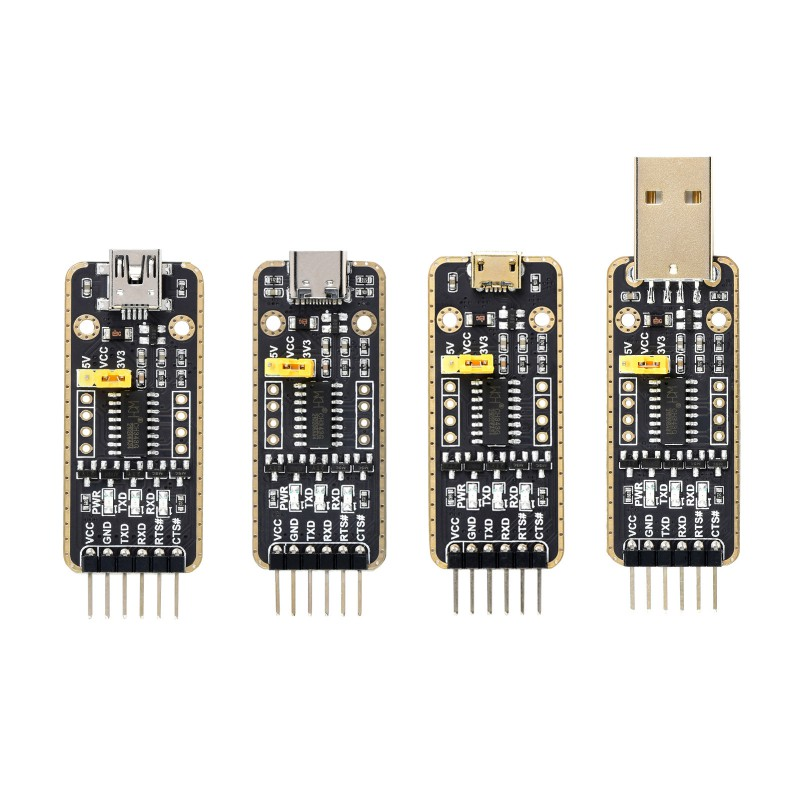

# Follow at your own risk!

But those should be general instructions for getting normal Debian installed
onto iomega ix2-200 NAS. Insructions here also asume that you already have Debian/Ubuntu
running somewhere like a PC or virtual-machine with usb passthough or a RaspberryPi.

# ** You need USB UART dongle **
To get access to the bootup messages and configure the u-boot(BIOS) on the Iomega
you need to get your hands on a 3.3v TTL USB UART converter board (NOT RS232 as that runs on +-12v)

For example: https://www.amazon.de/-/en/UART-TTL-Adapter-Converter-Compatible-Arduino/dp/B0B7RHPMT7/



You need to hook it up to the back side of the Iomega on to JP1 (also marks PIN 1)


    Pin 1: Do NOT connect. This pin provides +3.3V and is not required for USB UART serial adapters.
    Pin 2: TxD. Connect to RxD of the serial adapter.
    Pin 3: GND. Connect to GND of the serial adapter.
    Pin 4: RxD. Connect to TxD of the serial adapter.

After that is done open any [Serial Terminal Software](https://linux-sunxi.org/UART#Software) at Baud 115200, 8bit, 1stop parity none

Remove all HDD-s and power the iomega on. Now on the U-Boot prompt run `printenv` command 
and save all the output to `ix2-200-config-backup.txt`. Contents of that file is required to restore
original firmware if you want to in the future.

Source: https://kiljan.org/2021/04/22/installing-arch-linux-arm-on-an-iomega-ix2-200/#consolepreparation

# Files on usb stick

# 0. install packages

    sudo apt install u-boot-tools

# 1. Create ext2 usb stick

First figure out your usb stick name

    lsblk

**Make sure that your usb stick uses DOS/MBR partition table!!**

Then format it with ext2. Replace /dev/sdX1 with your stick name

    sudo mkfs.ext2 /dev/sdX1

And mount the usb stick to /mnt folder

    sudo mount /dev/sdX1 /mnt

To make things easier, lets change the usb stick permisions to be more open

    sudo chmod 777 /mnt

# 2. Download kernel, initramfs and device tree

First lets cd to the mounted usb device

    cd /mnt

And download files there

    wget http://ftp.debian.org/debian/dists/stable/main/installer-armel/current/images/kirkwood/device-tree/kirkwood-iomega_ix2_200.dtb
    wget http://ftp.debian.org/debian/dists/stable/main/installer-armel/current/images/kirkwood/netboot/vmlinuz-6.1.0-18-marvell
    wget http://ftp.debian.org/debian/dists/stable/main/installer-armel/current/images/kirkwood/netboot/initrd.gz

# 3. Build U-boot files

iomega has a realy old u-boot that does not support seperate device tree files.
We will append device tree dtb file end of the kernel images

    cat vmlinuz-6.1.0-18-marvell kirkwood-iomega_ix2_200.dtb > vmlinuz_with_dtb

then we have to wrap the kernel and initrd into u-boot image files

    mkimage -A arm -O linux -T ramdisk -C none -a 0x00000000 -e 0x00000000 -n initramfs -d initrd.gz uInitrd
    mkimage -A arm -O linux -T kernel  -C none -a 0x00008000 -e 0x00008000 -n kernel -d vmlinuz_with_dtb uImage

# 4. Unmount usb stick

**Do not simply unplug the usb drive from your computer!**

First lets make sure that all of the files are written to our usb stick by running sync
This command my take some time if you have a slow usb stick

    sync

Then unmount the usb stick

    sudo umount /mnt

# 5. Boot debian installer on iomega

**Note: Installation is done over UART serial connection at speed of 115200**

1. Plug the usb drive into iomega
2. power on the device
3. in u-boot promt start usb support

```
usb start
```

4. make sure that your usb drive is detected

```
usb storage
```

If its not detected, you can try again by running `reset`

5. Make sure that you can list files on the usb drive

```
ext2ls usb 0:1 /
```

6. Load files and boot

```
ext2load usb 0:1 0x00800000 /uImage
ext2load usb 0:1 0x01A00000 /uInitrd
setenv bootargs console=ttyS0,115200
bootm 0x00800000 0x01A00000
```

**Note:**

Those memory addresses are pretty random, you can use `memlayout.py` script to calculate those values. Memory base should be at 0x0.
At least thats what is written into the [Device Tree](https://git.kernel.org/pub/scm/linux/kernel/git/torvalds/linux.git/tree/arch/arm/boot/dts/kirkwood-iomega_ix2_200.dts?h=v4.19)

# 6. Install debian like normal
U-Boot on the ix2-200 only understands **DOS/MBR** partiton tables, GPT will not work. Some hackish protected MBR GPT hybrid might also work but thats untested!

Create a seperate /boot partiton type of about 200MB size with **ext2** file system!

Installer might tell you that it cant find any kernels to install, simply say `continue without a kernel`

Mark down the kernel args the installer gives you. Probably you need the `root=<device>` kernel argument line.

# 7. Install kernel

Before rebooting in the installer you have to change into shell window by pressing `ctrl+a` and then `n`

    chroot /target

and then install kernel

    apt install linux-image-marvell

After that we need to create uboot image files

    cd /boot
    cp /usr/lib/linux-image-6.1.0-18-marvell/kirkwood-iomega_ix2_200.dtb /boot
    cat vmlinuz-6.1.0-18-marvell kirkwood-iomega_ix2_200.dtb > vmlinuz_with_dtb
    mkimage -A arm -O linux -T kernel  -C none -a 0x00008000 -e 0x00008000 -n kernel -d vmlinuz_with_dtb uImage
    mkimage -A arm -O linux -T ramdisk -C none -a 0x00000000 -e 0x00000000 -n initramfs -d initrd.gz uInitrd

# 8. Finish install

# 9. Test bootup

In u-boot prompt

Start hdd support

    ide reset

List files in boot partition

    ext2ls ide 0:1 /

If you can see uImage and uInitrd then you can try to boot them

    ext2load ide 0:1 0x00800000 /uImage
    ext2load ide 0:1 0x01A00000 /uInitrd
    setenv bootargs console=ttyS0,115200 root=/dev/<device>
    bootm 0x00800000 0x01A00000

If it booted then you can follow with next step

# 10. configure autoboot

in u-boot prompt

    setenv loadfiles 'ide reset; ext2load ide 0:1 0x00800000 /uImage; ext2load ide 0:1 0x01A00000 /uInitrd'
    setenv bootargs console=ttyS0,115200 root=/dev/<device>
    setenv bootcmd 'run loadfiles; bootm 0x00800000 0x01A00000'

And thest if those commands work

    boot

If it boothed then you can reboot to u-boot prompt, run those setenv command again and this time instead of boot you save the variables with

    saveenv

# Kernel updates

After apt has updated your kernel you have to re generate the U-Boot images

Replace `VERSION` with your new kernel version. Version number should be visible if you `ls /boot`.

    cd /boot
    cp /usr/lib/linux-image-VERSION-marvell/kirkwood-iomega_ix2_200.dtb /boot
    cat vmlinuz-VERSION-marvell kirkwood-iomega_ix2_200.dtb > vmlinuz_with_dtb
    mkimage -A arm -O linux -T kernel  -C none -a 0x00008000 -e 0x00008000 -n kernel -d vmlinuz_with_dtb uImage
    mkimage -A arm -O linux -T ramdisk -C none -a 0x00000000 -e 0x00000000 -n initramfs -d initrd.img-VERSION-marvell uInitrd

## TODO
It is probably possible to automate those steps with some APT hooks but I haven't looked into it yet.

# Links


* https://github.com/lentinj/u-boot/blob/master/doc/README.sata
* https://blog.nobiscuit.com/2011/08/06/installing-debian-to-disk-on-an-ix2-200/
* https://github.com/arvati/debian-ix2-200#make-changes-in-uboot
